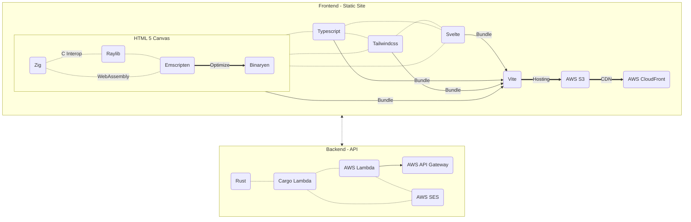
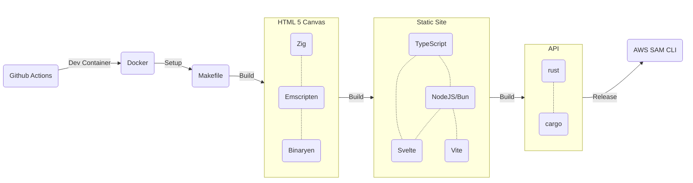

<h1 align="center"><a href="https://dylanlangston.com/">dylanlangston.com</a></h1>

  <strong>The source code for my personal website. <u>🚧 Currently under construction. 🚧</u></strong>

## Overview 👀

My personal website is built with a modern tech stack to ensure performance and flexibility. It utilizes the following technologies:
- [💻 Zig](https://ziglang.org/) and [🎮 raylib](https://www.raylib.com/) for client-side rendering.
- [🌐 Emscripten](https://emscripten.org/) for compiling to [🕸️ WebAssembly](https://webassembly.org/).
- [🛠️ Binaryen](https://github.com/WebAssembly/binaryen) for optimizing WebAssembly.
- [🦀 Rust](https://www.rust-lang.org/) for backend logic utilizing [🔢 AWS Lambda](https://aws.amazon.com/lambda/).
- [🖥️ Svelte](https://svelte.dev/) for building interactive user interfaces.
- [📝 TypeScript](https://www.typescriptlang.org/) for improving JavaScript code reliability and developer efficiency.
- [🎨 TailwindCSS](https://tailwindcss.com/) for styling components with utility-first CSS.
- [🚀 Vite](https://vitejs.dev/) for fast development and optimized production builds.
- Hosted on [🌍 AWS S3](https://aws.amazon.com/s3/) and distributed globally via [☁️ AWS CloudFront](https://aws.amazon.com/cloudfront/) for high availability and scalability.
- [📦 SAM CLI](https://github.com/aws/aws-sam-cli) for deploying serverless applications.

## Build Process 🏗️

The build process for my personal website involves the following steps:
1. **Development Environment Setup:** Use Docker for consistent environment setup across different machines. GitHub Actions can be integrated for automation.
2. **Code Compilation:** Utilize Rust for server-side code and Zig/Emscripten along with Svelte/TypeScript for client-side code.
3. **Optimization:** Optimize compiled assets for production using Binaryen and Vite to ensure minimal file sizes and optimal performance.
4. **Deployment:** Deploy optimized assets to AWS S3 and configure CloudFront for global content distribution using SAM CLI.

<!-- https://docs.github.com/en/get-started/writing-on-github/working-with-advanced-formatting/creating-diagrams -->
<!-- https://mermaid.js.org/syntax/flowchart.html -->

## Credits 🙌

The website design and development is the singular effort of [@dylanlangston](https://github.com/dylanlangston). Closed for contributions but feel free to fork or open an issue if you have a question!

## License 📜
This tool is licensed under the [MIT License](https://opensource.org/licenses/MIT). See the [`LICENSE`](LICENSE) file for details.
