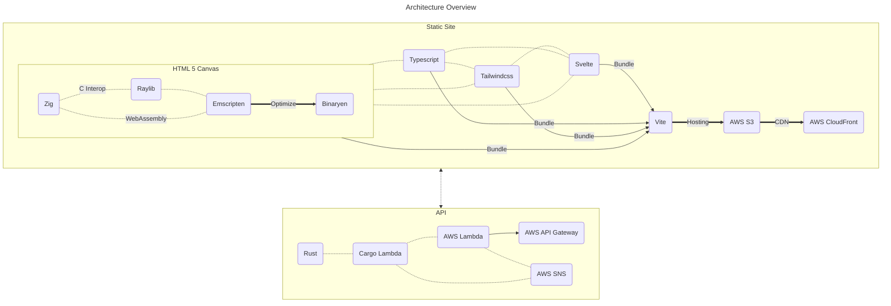
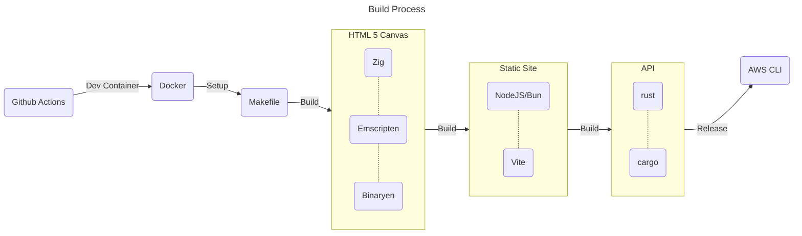

# 🚧 Under Construction 🚧

This is the future source code for my personal website. Currently under construction.

<!-- https://docs.github.com/en/get-started/writing-on-github/working-with-advanced-formatting/creating-diagrams -->
<!-- https://mermaid.js.org/syntax/flowchart.html -->

